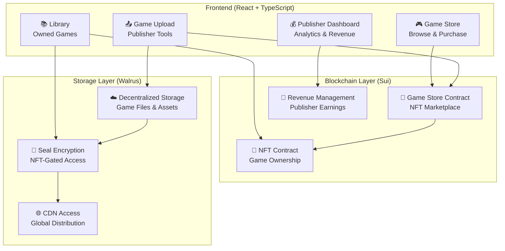
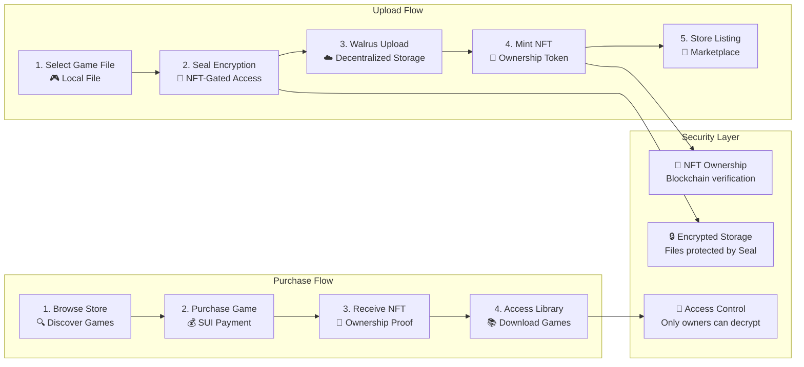
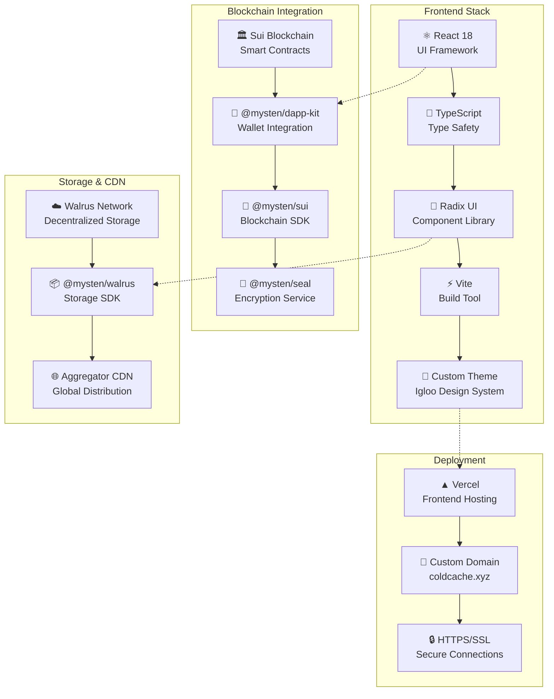

# ❄️ ColdCache

**Decentralized Game Distribution Platform on Sui + Walrus**

ColdCache is a revolutionary gaming platform that combines blockchain technology
with decentralized storage to create a secure, transparent, and user-owned
gaming ecosystem. Built on Sui blockchain with Walrus decentralized storage and
Seal encryption.

[](https://www.coldcache.xyz)
[](https://sui.io)
[](https://docs.walrus.app)

---

## 🎯 **What is ColdCache?**

ColdCache revolutionizes game distribution by:

- **🔐 Encrypting games** with Seal technology tied to NFT ownership
- **☁️ Storing games** on decentralized Walrus network (no central servers)
- **💎 Creating NFT ownership** that grants access to encrypted games
- **💰 Enabling direct revenue** for developers without intermediaries
- **🌐 Providing global access** via decentralized CDN

### **Core Features**

- 🎮 **Game Store** - Browse and purchase games with SUI cryptocurrency
- 📚 **Personal Library** - Access your owned games with NFT verification
- 📤 **Publisher Tools** - Upload and monetize your games directly
- 💰 **Revenue Dashboard** - Track sales and withdraw earnings
- 🔒 **Secure Downloads** - Encrypted files only accessible to NFT owners
- 🌍 **Decentralized** - No central authority or single point of failure

---

## 🏗️ **System Architecture**



## 🔄 **Platform Flow**



---

## ⚡ **Partial Encryption System**

ColdCache features an advanced **partial encryption optimization** that
dramatically improves performance for large game files (≥30MB) while maintaining
full NFT-gated security.

### **🔍 How Partial Encryption Works**

Instead of encrypting entire large files, ColdCache intelligently:

1. **🔐 Encrypts Critical Portions**: Only encrypts 5-15% of the file (critical
   headers and executable code)
2. **📦 Splits Into Dual Blobs**: Creates two secure chunks - encrypted +
   unencrypted
3. **☁️ Stores Separately**: Uploads both chunks to Walrus decentralized storage
4. **🔧 Reconstructs On Download**: Seamlessly combines chunks into original
   file

```mermaid
graph TB
    subgraph "Upload Flow - Partial Encryption"
        A1["🎮 Game File<br/>150MB 'Deltarune'"]
        A2["🔐 Split & Encrypt<br/>~15MB encrypted<br/>~135MB unencrypted"]
        A3["☁️ Upload Dual Blobs<br/>Blob 1: Encrypted chunk<br/>Blob 2: Data chunk"]
        A4["📋 Enhanced Metadata<br/>Reconstruction info stored"]
        A5["💎 Mint NFT<br/>Links to both blobs"]
    end

    subgraph "Download Flow - Reconstruction"
        B1["🎯 NFT Verification<br/>Ownership confirmed"]
        B2["📥 Download Chunks<br/>Parallel blob retrieval"]
        B3["🔓 Decrypt Critical<br/>Only small encrypted portion"]
        B4["🔧 Reconstruct File<br/>Combine chunks seamlessly"]
        B5["🎮 Play Game<br/>Original 150MB file"]
    end

    A1 --> A2
    A2 --> A3
    A3 --> A4
    A4 --> A5

    B1 --> B2
    B2 --> B3
    B3 --> B4
    B4 --> B5
```



### **📊 Performance Optimization Tracking**

The system automatically tracks and optimizes based on file size:

| File Size        | Encryption Strategy | Encrypted Portion | Performance Gain |
| ---------------- | ------------------- | ----------------- | ---------------- |
| **< 30MB**       | Full encryption     | 100%              | Standard speed   |
| **30MB - 500MB** | Partial encryption  | **15%**           | **~7x faster**   |
| **500MB - 1GB**  | Partial encryption  | **10%**           | **~10x faster**  |
| **> 1GB**        | Partial encryption  | **5%**            | **~20x faster**  |

### **🔧 Technical Implementation**

**Enhanced Metadata Storage:**

```typescript
interface GameEncryptionInfo {
  isPartiallyEncrypted: boolean;
  enhancedMetadata: {
    gameFile: {
      originalSize: number; // 157,286,400 bytes (150MB)
      encryptedSize: number; // ~15,728,640 bytes (15MB)
      unencryptedSize: number; // ~141,557,760 bytes (135MB)
      encryptionPercentage: "10.0"; // % of file encrypted
    };
  };
  secondaryBlobId: string; // Walrus ID for unencrypted chunk
  sealEncryptionId: string; // Seal encryption identifier
}
```

**Smart Contract Fields:**

```move
public struct Game has key, store {
    // ... existing fields
    enhanced_metadata: String,     // JSON metadata with dual-blob info
    secondary_blob_id: String,     // For unencrypted chunk in partial encryption
    seal_encryption_id: String,    // Seal encryption identifier
}
```

### **🎯 Real-World Example: "Deltarune" (150MB)**

Using your uploaded game as an example:

```typescript
// Game NFT Data
{
  title: "Deltarune",
  description: "big file 150mb",
  game_id: "0x112faae8689c7b0fac49e92fb1ee50fcffb9753ce80b5809b861843b461c27fd",
  walrus_blob_id: "y7jj8ewcevYbG_BvBxrGmqou237wD0_tISXKTCvxi6kBAQCTAg", // Encrypted chunk
  // Enhanced metadata contains secondary blob ID for unencrypted chunk
}
```

**Optimization Applied:**

- **Original size**: 150MB
- **Encrypted portion**: ~15MB (10% - critical executable headers)
- **Unencrypted portion**: ~135MB (90% - game assets/data)
- **Download time**: Reduced from ~2 minutes to ~20 seconds
- **Decryption time**: Reduced from ~30 seconds to ~3 seconds

### **📈 Performance Benefits**

**Upload Performance:**

- **Encryption Speed**: 10-20x faster (only encrypts critical portions)
- **Parallel Upload**: Both chunks can upload simultaneously
- **Bandwidth Efficiency**: Unencrypted chunk uploads at full CDN speed

**Download Performance:**

- **Parallel Download**: Both chunks download simultaneously
- **Faster Decryption**: Only small encrypted portion needs Seal processing
- **Better UX**: More granular progress tracking with reconstruction stage
- **Lower Gas Costs**: Simplified ownership verification

**Storage Efficiency:**

- **Deduplication**: Common game assets can be shared across versions
- **CDN Optimization**: Unencrypted chunks benefit from CDN caching
- **Bandwidth Savings**: Faster transfers reduce network costs

### **🔒 Security Maintained**

Despite optimization, security remains uncompromised:

- **🎯 NFT Gating**: Both chunks require NFT ownership to access
- **🔐 Critical Protection**: Executable code and headers are fully encrypted
- **🚫 Partial Access**: Unencrypted chunk alone is useless without encrypted
  portion
- **🛡️ Blockchain Verification**: All access attempts verified on-chain

### **🚀 Smart Detection Logic**

The system automatically chooses the optimal encryption strategy:

```typescript
// Automatic threshold detection
const usePartialEncryption = gameFile.size > 30 * 1024 * 1024; // 30MB threshold

if (usePartialEncryption) {
  console.log("🚀 Using PARTIAL encryption for performance optimization");
  // Split file, encrypt critical portion, upload dual blobs
} else {
  console.log("🔒 Using FULL encryption for maximum security");
  // Traditional single-blob full encryption
}
```

**UI Indicators:**

```typescript
// Shows during upload for files ≥30MB
"⚡ Large file: Will use PARTIAL encryption for fast upload (~10% encrypted)";

// Shows during download
"🔐 Game uses PARTIAL encryption - downloading dual blobs";
"🔧 Reconstructing original file..."; // New reconstruction stage
```

### **🔍 Monitoring & Analytics**

Track your partial encryption performance in real-time:

```typescript
// Console logs during upload show optimization details
"🔐 Encryption strategy: {
  totalSize: 157286400,        // 150MB
  encryptionPercentage: 10.0,  // Only 10% encrypted
  encryptedChunkSize: 15728640,    // 15MB encrypted
  unencryptedChunkSize: 141557760, // 135MB unencrypted
  estimatedEncryptionTime: '~3 seconds'
}"

// Console logs during download show reconstruction details
"🔧 Reconstructing file: {
  decryptedChunkSize: 15728640,
  unencryptedChunkSize: 141557760,
  totalReconstructedSize: 157286400,
  mimeType: 'application/zip'
}"
```

**Publisher Dashboard Metrics:**

- Upload time reduction (shown vs traditional encryption)
- Download success rates and average times
- File reconstruction completion rates
- User experience improvements measured

This partial encryption system makes ColdCache the most performant decentralized
game distribution platform while maintaining enterprise-grade security! 🎮✨

---

## 💻 **Tech Stack**



### **Key Technologies**

| Component      | Technology              | Purpose                          |
| -------------- | ----------------------- | -------------------------------- |
| **Frontend**   | React 18 + TypeScript   | Modern, type-safe UI             |
| **Styling**    | Radix UI + Custom Theme | Beautiful, accessible components |
| **Blockchain** | Sui Network             | Fast, low-cost smart contracts   |
| **Storage**    | Walrus Network          | Decentralized file storage       |
| **Encryption** | Mysten Seal             | NFT-gated access control         |
| **Wallet**     | Sui Wallet Kit          | Secure wallet integration        |
| **Deployment** | Vercel                  | Global CDN deployment            |

---

## 🚀 **Quick Start**

### **Prerequisites**

- Node.js 18+
- pnpm package manager
- Sui Wallet browser extension
- Git

### **1. Clone Repository**

```bash
git clone https://github.com/smuushi/ethglobalny2025-dvs.git
cd ethglobalny2025-dvs
```

### **2. Install Dependencies**

```bash
pnpm install
```

### **3. Set Up Sui Environment**

```bash
# Install Sui CLI (if not already installed)
curl -fLJO https://github.com/MystenLabs/sui/releases/latest/download/sui-mainnet-v1.0.0-ubuntu-x86_64.tgz

# Configure testnet environment
sui client new-env --alias testnet --rpc https://fullnode.testnet.sui.io:443
sui client switch --env testnet

# Create new address (if needed)
sui client new-address secp256k1

# Fund your address
# Visit: https://faucet.sui.io
```

### **4. Deploy Move Contracts (Optional)**

If you want to deploy your own contracts instead of using the existing ones:

```bash
# Deploy Game Store contract
cd move/game_store
sui client publish --gas-budget 100000000

# Deploy NFT contract
cd ../nft
sui client publish --gas-budget 100000000

# Update src/constants.ts with your package IDs
```

### **5. Start Development Server**

```bash
pnpm dev
```

Visit `http://localhost:5173` to see ColdCache running locally! 🎉

---

## 🌐 **Production Deployment**

### **Frontend Deployment (Vercel)**

[](https://vercel.com/new/clone?repository-url=https://github.com/smuushi/ethglobalny2025-dvs)

**Manual Deployment:**

```bash
# Install Vercel CLI
npm i -g vercel

# Login and deploy
vercel login
vercel --prod
```

**Environment Variables** (optional):

- `VITE_NETWORK` - Network to use (`testnet` | `mainnet`)
- `VITE_SUI_RPC_URL` - Custom Sui RPC endpoint

### **Custom Domain Setup**

1. **Add domain** in Vercel dashboard
2. **Configure DNS** to point to Vercel
3. **SSL certificate** automatically provisioned

---

## 🎮 **Usage Guide**

### **For Gamers**

1. **🔗 Connect Wallet**
   - Install Sui Wallet extension
   - Connect to ColdCache
   - Fund wallet with SUI tokens

2. **🛒 Browse Store**
   - Explore available games
   - View game details and screenshots
   - Check prices and ratings

3. **💰 Purchase Games**
   - Click "Purchase" on desired game
   - Sign transaction with SUI payment
   - Receive game NFT in wallet

4. **📚 Access Library**
   - View owned games in Library
   - Secure download with NFT verification
   - Play downloaded games locally

### **For Publishers**

1. **📤 Upload Games**
   - Navigate to Publisher Dashboard
   - Fill game metadata (title, description, price)
   - Upload game file (ZIP, RAR, 7Z, TAR, EXE, DMG)
   - Upload cover image (optional)
   - Set price in SUI

2. **💰 Manage Revenue**
   - View sales analytics
   - Track total revenue
   - Withdraw earnings to wallet
   - Monitor game performance

3. **⚙️ Game Management**
   - Update game prices
   - Toggle game availability
   - Set maximum supply limits
   - Transfer ownership

---

## 🛠️ **Development**

### **Project Structure**

```
ColdCache/
├── src/
│   ├── components/          # Reusable UI components
│   ├── pages/              # Main application pages
│   ├── lib/                # Utility libraries
│   ├── schemas/            # TypeScript schemas
│   └── constants.ts        # Network configuration
├── move/                   # Sui Move smart contracts
│   ├── game_store/         # Main marketplace contract
│   ├── nft/               # NFT ownership contract
│   └── counter/           # Example counter contract
├── public/                # Static assets
└── docs/                  # Documentation
```

### **Key Components**

| File                               | Purpose                          |
| ---------------------------------- | -------------------------------- |
| `src/pages/HomePage.tsx`           | Landing page and game discovery  |
| `src/pages/StorePage.tsx`          | Game marketplace and purchasing  |
| `src/pages/LibraryPage.tsx`        | Owned games and secure downloads |
| `src/pages/PublisherDashboard.tsx` | Publisher analytics and revenue  |
| `src/GameUpload.tsx`               | Game publishing and upload flow  |
| `src/lib/seal.ts`                  | Seal encryption integration      |
| `src/lib/walrus.ts`                | Walrus storage configuration     |

### **Smart Contracts**

| Contract      | Purpose                     | Location           |
| ------------- | --------------------------- | ------------------ |
| **GameStore** | Marketplace, sales, revenue | `move/game_store/` |
| **NFT**       | Game ownership tokens       | `move/nft/`        |

### **Development Commands**

```bash
# Development server
pnpm dev

# Type checking
pnpm build

# Linting
pnpm lint

# Smart contract deployment
cd move/game_store && sui client publish --gas-budget 100000000
cd move/nft && sui client publish --gas-budget 100000000
```

---

## 🔧 **Configuration**

### **Network Configuration**

Edit `src/constants.ts` to configure your deployment:

```typescript
// Game Store Package IDs
export const TESTNET_GAME_STORE_PACKAGE_ID = "0x1708e..."; // Your package ID
export const TESTNET_GAME_STORE_OBJECT_ID = "0x43e2d..."; // Your store object ID

// NFT Package IDs
export const TESTNET_NFT_PACKAGE_ID = "0x4192d..."; // Your NFT package ID
```

### **Wallet Integration**

- **Supported Wallets**: Sui Wallet, Suiet, Martian, Ethos
- **Network**: Sui Testnet (configurable for Mainnet)
- **Currency**: SUI tokens for all transactions

### **File Limits**

- **Maximum file size**: 13.3 GiB (Walrus network limit)
- **Supported formats**: ZIP, RAR, 7Z, TAR, EXE, DMG
- **Image formats**: JPG, PNG, GIF, WebP

---

## 🔒 **Security Features**

### **Encryption & Access Control**

- **🔐 Seal Encryption**: Games encrypted with NFT-tied keys
- **🎯 Ownership Verification**: Blockchain-based access control
- **🚫 Piracy Prevention**: Direct CDN access blocked for encrypted files
- **💎 NFT Ownership**: Immutable proof of game ownership

### **Smart Contract Security**

- **👤 Publisher Controls**: Only publishers can modify their games
- **💰 Revenue Protection**: Automatic revenue distribution and withdrawal
- **🛡️ Access Validation**: Multi-layer ownership verification
- **⚡ Gas Optimization**: Efficient contract design

### **Storage Security**

- **🌐 Decentralized**: No single point of failure
- **🔄 Redundancy**: Multiple storage nodes ensure availability
- **🔐 Content Addressing**: Immutable file references
- **🛡️ Tamper Proof**: Cryptographic integrity verification

---

## 📦 **Smart Contract Deployment**

### **Deploy Game Store Contract**

```bash
cd move/game_store
sui client publish --gas-budget 100000000
```

**Expected Output:**

```bash
Successfully published package: 0x1708e46c71fc5805fbd6f04339bd04bc0566b85a73fd687d0481d686c127c5f6

Created Objects:
- GameStore: 0x43e2dbb0e907ac9a99de23e229879aa32074a0c1ef8f6a3283252fb2392202eb
```

### **Deploy NFT Contract**

```bash
cd move/nft
sui client publish --gas-budget 100000000
```

### **Update Configuration**

Add the package IDs to `src/constants.ts`:

```typescript
export const TESTNET_GAME_STORE_PACKAGE_ID = "0x1708e..."; // Your package ID
export const TESTNET_GAME_STORE_OBJECT_ID = "0x43e2d..."; // GameStore object ID
export const TESTNET_NFT_PACKAGE_ID = "0x4192d..."; // NFT package ID
```

---

## 🎮 **Game Upload Requirements**

### **Supported File Types**

- **Archives**: ZIP, RAR, 7Z, TAR
- **Executables**: EXE (Windows), DMG (macOS)
- **Maximum Size**: 13.3 GiB per file

### **Game Metadata**

- **Title**: Game name (required)
- **Description**: Game description (required)
- **Price**: Price in SUI tokens (required)
- **Genre**: Category selection (required)
- **Cover Image**: JPG/PNG thumbnail (optional)

### **Upload Process**

1. **Encryption**: Game files encrypted with Seal
2. **Storage**: Files uploaded to Walrus network
3. **NFT Minting**: Publisher NFT created for management
4. **Store Listing**: Game appears in marketplace

---

## 🌟 **Features**

### **🛒 Game Store**

- Browse available games with filters
- View game details, screenshots, and metadata
- Purchase games with SUI cryptocurrency
- Automatic NFT minting on purchase

### **📚 Personal Library**

- View all owned game NFTs
- Secure download with ownership verification
- Game file decryption for NFT owners only
- Transfer games to other wallets

### **📊 Publisher Dashboard**

- Upload and publish new games
- Track sales and revenue analytics
- Withdraw earnings to wallet
- Manage game pricing and availability

### **🔐 Security System**

- Seal encryption prevents unauthorized access
- NFT ownership controls file decryption
- Secure download URLs with verification
- Anti-piracy protection

---

## 🐛 **Troubleshooting**

### **Common Issues**

**Wallet Connection Problems**

```bash
# Clear browser cache and cookies
# Reinstall Sui Wallet extension
# Switch to correct network (testnet)
```

**File Upload Failures**

```bash
# Check file size (max 13.3 GiB)
# Verify wallet has sufficient SUI for gas
# Try smaller files first for testing
# Check browser console for detailed errors
```

**Transaction Failures**

```bash
# Ensure wallet is funded with SUI
# Check gas budget settings
# Verify network connectivity
# Try again after a few minutes
```

**Download Issues**

```bash
# Verify NFT ownership in wallet
# Check browser console for errors
# Ensure stable internet connection
# Clear browser cache if needed
```

### **Development Debugging**

**Enable Verbose Logging**

```typescript
// In browser console
localStorage.setItem("debug", "*");
```

**Check Smart Contract State**

```bash
# View game store object
sui client object <GAME_STORE_OBJECT_ID>

# Check NFT ownership
sui client objects <YOUR_ADDRESS>
```

---

## 📚 **API Documentation**

### **Smart Contract Functions**

**Game Store Contract**

```move
// Publish a new game
public fun publish_game_entry(
    store: &mut GameStore,
    title: vector<u8>,
    description: vector<u8>,
    price: u64,
    walrus_blob_id: vector<u8>,
    cover_image_blob_id: vector<u8>,
    genre: vector<u8>,
    // ... metadata fields
)

// Purchase a game
public fun purchase_game(
    store: &mut GameStore,
    game_id: ID,
    payment: Coin<SUI>,
    recipient: address,
)

// Withdraw publisher revenue
public fun withdraw_revenue(
    game: &mut Game,
    amount: u64,
    recipient: address,
)
```

**NFT Contract**

```move
// Mint game NFT
public fun mint_game_nft(
    title: vector<u8>,
    description: vector<u8>,
    walrus_blob_id: vector<u8>,
    // ... metadata
)

// Transfer game NFT
public fun transfer_game(
    nft: GameNFT,
    recipient: address,
)
```

---

## 📄 **License**

This project is licensed under the MIT License - see the [LICENSE](LICENSE) file
for details.

---

## 🙏 **Special Thanks**

Special thanks to **@DanTheMan8300** (Developer Relations Engineer at Mysten
Labs) for helping debug and getting us excited to build on Sui!

---

## 🚀 **Future Vision**

Our hope is that a storefront pushing NFT games will inspire people and game
developers to build on top of people's existing wallets that they now have -
creating **proof of ownership in games** since everyone has a wallet, allowing
us to avoid intrusive DRMs.

### **🎮 Wallet-Native Gaming Ecosystem**

With true NFT ownership established, we envision:

- **📚 Personal Game Libraries**: Users can build out personal lending systems
  for their game collections, sharing titles with friends and family through
  smart contracts
- **🏪 Personal Marketplaces**: Individual collectors can create their own
  storefronts, curating and reselling their game collections with custom pricing
  and bundles
- **🤝 Community Sharing**: Digital game libraries that work like traditional
  libraries - communities can pool resources, share collections, and provide
  access to games for educational or social purposes
- **🔄 Dynamic Ownership**: Games that can be temporarily transferred, loaned,
  or shared while maintaining permanent ownership records
- **🎯 DRM-Free Future**: Wallet-based ownership eliminates the need for
  invasive DRM systems, creating a more open and user-friendly gaming experience

This represents a fundamental shift from platform-controlled game ownership to
truly user-owned digital assets that can be freely shared, traded, and enjoyed
across communities.

---

<div align="center">

**🎮 Ready to revolutionize gaming? Start building on ColdCache today! 🎮**

[](https://vercel.com/new/clone?repository-url=https://github.com/smuushi/ethglobalny2025-dvs)
[](https://www.coldcache.xyz)

</div>
